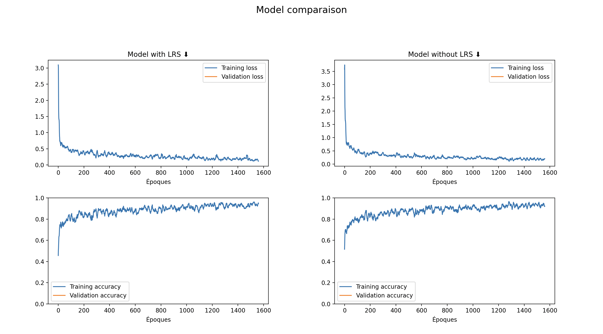

# Classification des maladies du maïs

## Description du projet
Ce projet vise à développer un modèle de classification des maladies du maïs. Il utilise un ensemble de données disponible sur [Kaggle](https://www.kaggle.com/datasets/smaranjitghose/corn-or-maize-leaf-disease-dataset). Le projet implémente deux versions du modèle en utilisant PyTorch : une avec un taux d'apprentissage standard et l'autre avec un *learning rate scheduler* pour comparer les performances.

## Installation
Pour installer les dépendances, exécutez :
```bash
pip install -r requirements.txt
```

Les données disponibles à cette [adresse](https://www.kaggle.com/datasets/smaranjitghose/corn-or-maize-leaf-disease-dataset) (169M) doivent être placées dans le répertoire `./data/`.

Les poids optimaux sont directement téléchargeables à cette [adresse](https://drive.google.com/drive/u/0/folders/1vbMVLZ8FK9xcIkZX_zoF8f6HMTJlFcrz) pour ne pas avoir à réentraîner le modèle. Ils doivent être déposés dans le répertoire `./checkpoints/`.

Ainsi, la structure finale de ce projet est :
```
.
├── ./README.md
├── ./checkpoints
│   ├── ./with_lrs
│   │   └── epoch_10.pth
│   └── ./without_lrs
│       └── epoch_10.pth
├── ./config.py
├── ./data
│   ├── ./Blight
│   │   ├──./Corn_Health (1).jpg
│   │   └── [...]
│   ├── ./Common_Rust
│   │   └── [...]
│   ├── ./Gray_Leaf_Spot
│   │   └── [...]
│   └── ./Healthy
│       └── [...]
├── ./data.py
├── ./logger.py
├── ./main.py
├── ./models.py
├── ./requirements.txt
├── ./train.py
├── ./transforms.py
└── ./utils.py
```

## Usage
Dans `config.py`, on veillera à spécifier le `device` : soit `cpu`, `cuda` ou `mps`. De même pour l'entraînement du modèle en indiquant `use_checkpoint` à `True` ou `False`.

Pour observer les résultats, exécutez :
```bash
python3 main.py
```

## Graphes d'apprentissage
Je ne suis pas parvenu à obtenir une mesure de de la `loss` ou bien de l'`accuracy` sur l'ensemble de validation à chaque batch.


## Note sur l'utilisation de `config.py`
Il est préférable de ne pas utiliser `config.py`, mais plutôt le YAML pour gérer les paramètres de configuration, en raison des préoccupations liées à la sécurité. Les fichiers Python, tels que config.py, sont exécutables, ce qui signifie que tout code qu'ils contiennent est exécuté lors de l'importation. Cela peut entraîner des vulnérabilités importantes si un code malveillant est inséré dans le fichier de configuration, en particulier s'il est accessible ou modifiable par des utilisateurs moins privilégiés. En revanche, les alternatives telles que YAML sont plus sûres car elles ne sont pas exécutables et sont analysées, réduisant ainsi le risque d'exécution involontaire de code. Il est toujours recommandé de privilégier une gestion sécurisée des paramètres de configuration.

## TODO
- clean EDA
- clean code
- more docstring
- improve plotting
- improve test
